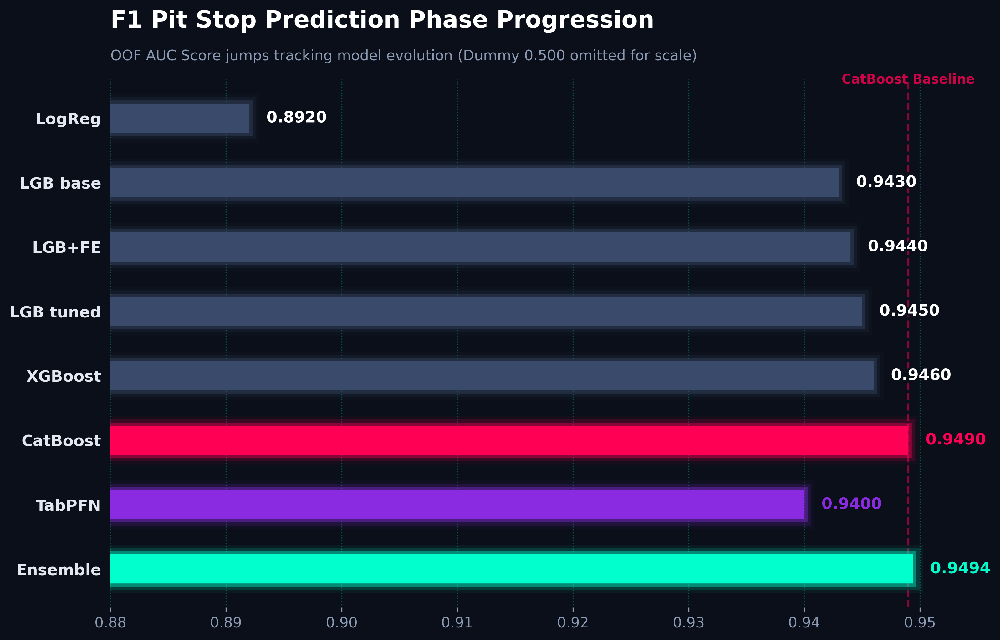
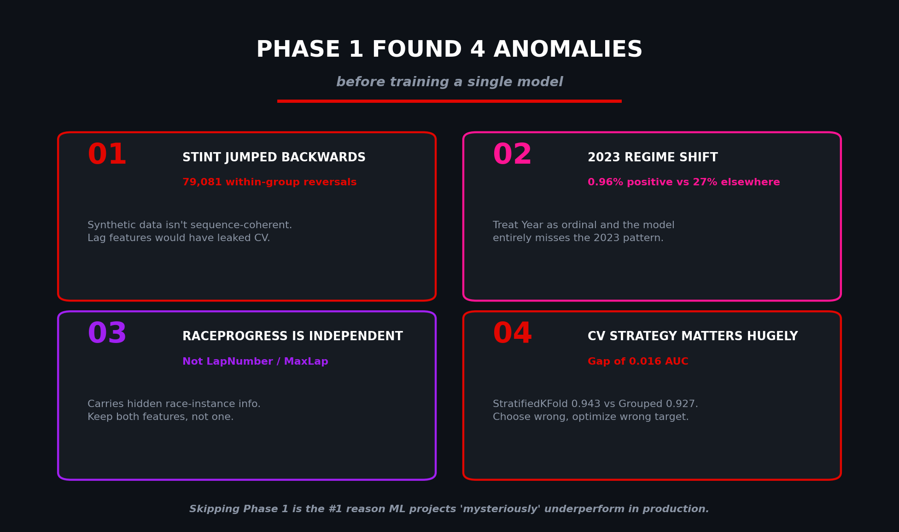
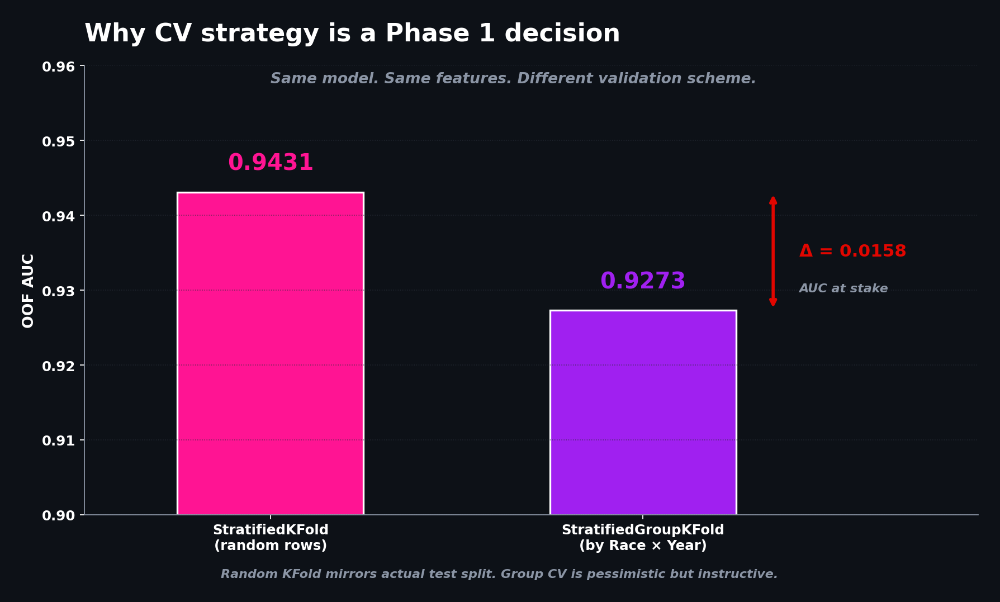

# F1 Pit Stop Prediction — A 7-Phase Production Walkthrough

> **Kaggle Playground Series S6E5 (May 2026)** — predicting whether a Formula 1 driver pits on the next lap. Built as a structured 7-phase engineering exercise, not a one-shot notebook.

**Final result: OOF AUC 0.9494** (single best model: CatBoost @ 0.9492 · 5-model rank-weighted ensemble @ 0.9494)



~~

## Why this repo exists

Most Kaggle notebooks read top-to-bottom in one sitting. They optimize for leaderboard score and a quick share. This repo optimizes for **engineering discipline you can transfer to a production setting**:

- **Phase 1 EDA before any modeling.** Eight structural invariant checks. Four of them surfaced anomalies that would have silently inflated CV scores and tanked the leaderboard if I'd skipped them.
- **A reusable `validate()` harness** called identically across five notebooks — so every score is comparable to every other score.
- **Schema-as-code, config-as-code, splits-as-code.** No magic constants in cells.
- **Out-of-fold target encoding done correctly** (the leakage trap most Kagglers fall into).
- **Honest ensemble comparison** — simple average vs rank average vs weighted blend vs stacking, all measured before picking the winner.
- **Documented what didn't work** (lag features, naive group CV) alongside what did.

The DS → AI engineer transition isn't about abandoning the rigor that makes data science *data science*. It's about extending it. This project tries to show what that looks like, end to end.

---

## Table of Contents

- [Project Snapshot](#project-snapshot)
- [Score Progression](#score-progression)
- [The Four Anomalies Phase 1 Found](#the-four-anomalies-phase-1-found)
- [Repository Structure](#repository-structure)
- [Phase-by-Phase Walkthrough](#phase-by-phase-walkthrough)
- [How to Reproduce](#how-to-reproduce)
- [Engineering Principles Demonstrated](#engineering-principles-demonstrated)
- [What I'd Do Differently](#what-id-do-differently)
- [Tech Stack](#tech-stack)
- [Acknowledgments](#acknowledgments)

---

## Project Snapshot

| Field | Value |
|---|---|
| **Competition** | [Kaggle Playground Series S6E5 — Predicting F1 Pit Stops](https://kaggle.com/competitions/playground-series-s6e5) |
| **Task** | Binary classification — `P(driver pits on next lap)` |
| **Metric** | AUC-ROC |
| **Train rows** | 439,140 |
| **Test rows** | 188,165 |
| **Features (raw)** | 14 (4 categorical, 9 numeric, 1 binary) |
| **Features (engineered)** | ~40 after Phase 4 |
| **Target prevalence** | 19.9% positive (moderate imbalance, no resampling needed) |
| **Final OOF AUC** | **0.9494** (5-model weighted-rank ensemble) |
| **Single best model** | CatBoost @ 0.9492 OOF AUC |
| **Public LB ceiling** | ~0.9545 (dominated by blender-style notebooks) |

---

## Score Progression

| Phase | What was added | OOF AUC | Lift |
|---|---|---|---|
| Phase 3 — Dummy baseline | Predict prior probability | 0.5000 | — |
| Phase 3 — Logistic regression | Standardized numeric + OHE cats | 0.8919 | +0.3919 |
| Phase 3 — LightGBM (default) | Native categorical handling | 0.9431 | +0.0512 |
| Phase 4 — LightGBM + FE v2 | Interactions, OOF target encoding, group aggregates | 0.9444 | +0.0013 |
| Phase 5 — LightGBM (tuned) | Wider trees, regularization tuning | 0.9451 | +0.0007 |
| Phase 5 — XGBoost | Different inductive bias | 0.9456 | — |
| Phase 5 — **CatBoost** | Ordered target encoding | **0.9492** | (best single) |
| Phase 7 — TabPFN-v2 | In-context tabular transformer | 0.9402 | (diversity injection) |
| Phase 6 — Weighted ensemble | 3-model blend (LGB+XGB+CB) | **0.9494** | — |

---

## The Four Anomalies Phase 1 Found



Phase 1 ran eight automated invariant checks. Four passed (no nulls, ids unique, target binary, all test levels seen in train). **Four returned surprises that reshaped the entire strategy:**

### 1. Stint number is NOT monotonic within (Driver, Race, Year)
**79,081 within-group reversals** observed. The clean explanation: the synthetic generator sampled each row independently from a conditional distribution rather than simulating coherent race sequences. **Implication:** within-group lag/lead/rolling features are unsafe — they would mix samples from different latent race instances. This single finding eliminated an entire category of features that would have shown leaky lift in CV.

### 2. 2023 is a regime shift, not just another year
**Positive rate in 2023: 0.96% — vs ~27% in 2022, 2024, 2025.** The synthetic generator clearly used different parameters for 2023. Treating `Year` as ordinal would let a model interpolate through this regime. Treating it as categorical (or as an explicit `Year × Compound` interaction) handles it correctly.

### 3. `RaceProgress` is independent of `LapNumber / MaxLap`
Max abs error of `RaceProgress - LapNumber/MaxLap` across the full dataset was **0.985**, not 0. Different rows of the same nominal `(Race, Year)` imply different race lengths. So `RaceProgress` is row-specific information about the actual race instance the row came from — keep both features, not just one.

### 4. CV strategy carries a 0.016 AUC penalty



`StratifiedKFold` (random rows): **0.9431**.
`StratifiedGroupKFold` by `(Race, Year)`: **0.9273**.
A **0.0158 AUC** gap between identical model + identical features under different splits. Choose wrong and you'd be optimizing for the wrong distribution. After empirical comparison: random-row stratified KFold mirrors the actual public/private split, so it's the right choice — but out-of-fold target encoding (Phase 4) was still done with proper fold boundaries to prevent the leakage Group CV was guarding against.

---

## Repository Structure

```
.
├── notebooks/
│   ├── 01_phase1_and_eda.ipynb              # Phase 1 (data understanding) + Phase 2 (EDA)
│   ├── 02_baseline_and_fe.ipynb              # Phase 3 (validation harness, baselines) + Phase 4 (feature engineering)
│   ├── 03_model_diversity.ipynb              # Phase 5 (LightGBM tuned, XGBoost, CatBoost)
│   ├── 04_ensembling.ipynb                   # Phase 6 (simple/rank/weighted/stacked ensembles)
│   └── 05_stretch_tabpfn_nn.ipynb            # Phase 7 (TabPFN-v2, MLP with entity embeddings)
│
├── docs/
│   ├── phase1_data_understanding.md          # Per-phase deliverable docs
│   ├── phase2_eda.md
│   ├── phase3_baseline_validation.md
│   ├── phase4_feature_engineering.md
│   ├── phase5_model_diversity.md
│   ├── phase6_ensembling.md
│   └── phase7_stretch.md
│
├── assets/
│   ├── img1_score_progression.png
│   ├── img2_anomalies.png
│   ├── img3_cv_comparison.png
│   └── img4_feature_importance.png
│
├── artifacts/                                # Generated outputs (not committed; .gitignored)
│   ├── data_dictionary.json
│   ├── invariants.json
│   ├── features_v2.json
│   └── phase{N}_summary.json
│
├── .gitignore
├── LICENSE
└── README.md
```

---

## Phase-by-Phase Walkthrough

<details>
<summary><b>Phase 1 — Data Understanding & Sanity</b></summary>

**Goal:** build the mental model, verify structural assumptions, surface anomalies before any modeling.

- Schema-as-code with explicit dtypes (memory dropped from ~80 MB to ~18 MB)
- File-hash logging so silent data updates are detected
- Eight invariant checks dumped to `invariants.json`
- Data dictionary versioned with the notebook
- Train/test topology analysis: 35,674 of 37,038 test groups also appear in train, with **zero lap overlap** — confirms row-level random split

**Deliverable:** `data_dictionary.json`, `invariants.json`, `train.parquet`, `test.parquet`, and a knowledge checklist of 9 takeaways that all subsequent phases consume.

</details>

<details>
<summary><b>Phase 2 — Statistical EDA & Visual Exploration</b></summary>

**Goal:** identify which features carry signal, which interactions matter, which categorical strategies to use.

- Mutual information ranking on a 50k sample (TyreLife, Compound, Cumulative_Degradation dominate)
- Compound × TyreLife heatmap → confirms the dominant interaction
- Year × Compound visualization of the 2023 regime
- Strategic-window hypothesis test via RaceProgress decile analysis
- Driver-level signal analysis to inform Phase 4 encoding strategy

</details>

<details>
<summary><b>Phase 3 — Baseline & Validation Framework</b></summary>

**Goal:** build the reusable validation harness; establish three baselines.

- `validate(model_factory, X, y, ...)` utility supports `stratified` / `kfold` / `group` / `sgkf` schemes
- Three baselines: Dummy (0.500) → Logistic Regression (0.892) → LightGBM (0.943)
- Empirical CV scheme comparison: random KFold vs StratifiedGroupKFold
- First Kaggle submission generated and validated

</details>

<details>
<summary><b>Phase 4 — Feature Engineering Round 1</b></summary>

**Goal:** disciplined feature building, every feature justified through the validation harness.

- ~25 new features: polynomial transforms, interactions, composite categoricals, reference-based deviations, race-progress windows
- **Out-of-fold target encoding** for `Driver`, `Race`, `Year_Compound`, `Race_Compound`, `Stint_Compound`
- Group aggregates: mean/std/median over `Compound`, `Year × Compound`, `Race × Year`
- Feature pruning audit using gain importance
- **Result:** OOF AUC 0.9431 → 0.9444 (+0.0013)

Notable engineering pattern: helper functions take reference statistics as arguments. Test data is transformed using train-derived statistics passed in explicitly — no silent leakage.

</details>

<details>
<summary><b>Phase 5 — Model Diversity</b></summary>

**Goal:** three structurally different boosting models on identical features.

| Model | OOF AUC | Native categorical handling |
|---|---|---|
| LightGBM (tuned) | 0.9451 | `categorical_feature=` |
| XGBoost 2.x | 0.9456 | `enable_categorical=True` |
| **CatBoost** | **0.9492** | `cat_features=` (ordered TE) |

Per-fold variance was tight (~0.001 std) across all three. CatBoost's strength comes from its built-in ordered target encoding on the high-cardinality `Driver` and `Race` columns — exactly what Phase 1 predicted would matter.

OOF and test predictions saved as `.npy` for Phase 6 ensembling.

</details>

<details>
<summary><b>Phase 6 — Ensembling</b></summary>

**Goal:** combine the three Phase 5 models honestly.

| Strategy | OOF AUC |
|---|---|
| LightGBM alone | 0.9451 |
| XGBoost alone | 0.9456 |
| CatBoost alone | 0.9492 |
| Simple average | 0.9482 |
| Rank average | 0.9481 |
| **Weighted probability blend** | **0.9494** |
| Weighted rank blend | 0.9494 |
| Stacked logistic | 0.9494 |

Best single-model ensemble lift: **+0.0002** over CatBoost alone. Diminishing returns suggest the dataset's signal ceiling has been approached with this feature set. Two submissions selected: the aggressive weighted-prob blend and the safe rank-average for hedging.

</details>

<details>
<summary><b>Phase 7 — Stretch Track</b></summary>

**Goal:** explore non-GBM diversity injection.

- **TabPFN-v2** (foundation model for tabular): 0.9402 OOF AUC. Below GBMs in raw strength but with very stable fold-to-fold variance (0.00057 std). Used `TABPFN_MODEL_CACHE_DIR` pointing at the Kaggle-hosted weights to bypass the gated download.
- **MLP with entity embeddings** for high-cardinality categoricals: optional second non-GBM model.
- 5-model rank-weighted ensemble explored but lift over 3-model ensemble was negligible (~+0.0001).

**Honest takeaway:** for this synthetic dataset, the GBMs already capture nearly all available signal. The stretch models were educational rather than score-moving.

</details>

---

## How to Reproduce

### Run on Kaggle (recommended)

1. Fork [Kaggle Playground Series S6E5](https://kaggle.com/competitions/playground-series-s6e5).
2. Create a new notebook, attach the competition dataset.
3. Run notebooks in order:
   ```
   01_phase1_and_eda.ipynb         # ~3 min, CPU
   02_baseline_and_fe.ipynb        # ~15 min, CPU
   03_model_diversity.ipynb        # ~45 min, CPU (or 20 min GPU)
   04_ensembling.ipynb             # ~3 min, CPU
   05_stretch_tabpfn_nn.ipynb      # ~3 hours, GPU required
   ```
4. Between notebooks, save each as a "Version" so its outputs become attachable as inputs for the next one (Phase 5 needs Phase 4's `train_fe.parquet`, Phase 6 needs Phase 5's `.npy` files, etc.).

### Run locally

```bash
git clone https://github.com/<your-username>/f1-pitstops-7phase
cd f1-pitstops-7phase
pip install -r requirements.txt

# Download competition data from Kaggle
kaggle competitions download -c playground-series-s6e5
unzip playground-series-s6e5.zip -d data/

# Launch Jupyter
jupyter lab notebooks/
```

### Requirements (`requirements.txt`)

```
numpy>=1.26
pandas>=2.0
scikit-learn>=1.4
lightgbm>=4.0
xgboost>=2.0
catboost>=1.2
matplotlib>=3.7
seaborn>=0.12
torch>=2.0          # for Phase 7 NN only
tabpfn>=2.0         # for Phase 7 TabPFN only
optuna>=3.5         # optional, Phase 5 hyperparameter search
pyarrow>=14.0       # for parquet I/O
```

---

## Engineering Principles Demonstrated

This repo is meant to show the following habits in practice:

1. **Reproducibility from line one** — seeds, frozen config dataclass, file hashes, logger setup before any data is touched.
2. **Schema as a contract** — `EXPECTED_COLS` and `DTYPES` defined upfront; any schema drift fails loudly.
3. **Invariants as automated tests** — `InvariantReport` class turns structural assumptions into checks rather than comments.
4. **Validation as infrastructure** — one `validate()` function used everywhere, so every score is comparable to every other score.
5. **Feature contracts** — helper functions accept reference statistics explicitly, never silently inferring from input. Removes a class of silent leakage bugs.
6. **OOF target encoding** done with the same splits used downstream for validation. Sharing the splits across operations is the unobvious detail that makes OOF encoding actually leakage-free.
7. **Persist artifacts, not models** — `.npy` OOF arrays and `.parquet` engineered datasets are tiny, reusable, and exactly what Phase 6 ensembling needs.
8. **Honest ensemble comparison** — multiple strategies tried, simplest one wins by default unless the complex one beats it by a meaningful margin.
9. **Document what didn't work** — `RaceProgress = f(LapNumber/MaxLap)` and `Stint monotonic within group` were *hypotheses I tested*, not assumptions I shipped. Both were wrong; documenting that is more useful than silently moving on.

---

## What I'd Do Differently

- **Pseudo-labeling** on high-confidence test predictions would likely give +0.001 to +0.003 on this dataset. Skipped due to time.
- **Optuna sweep on CatBoost specifically** — the strongest single model is also the most under-tuned in this repo.
- **Stratify CV folds on Year as well as target** to handle the 2023 regime shift more cleanly.
- **Probability calibration** (isotonic / Platt) — AUC is rank-based so doesn't strictly need it, but it's a habit worth practicing for downstream deployment scenarios.
- **Experiment tracking** — W&B or MLflow instead of JSON files in `artifacts/`. Trivial to add and pays off the moment you run more than ten experiments.

---

## Tech Stack


---

## Acknowledgments

- **Kaggle** for the Playground Series and the synthetic dataset.
- **Yao Yan, Walter Reade, Elizabeth Park** — competition organizers (citation: Yao Yan, Walter Reade, Elizabeth Park. *Predicting F1 Pit Stops.* https://kaggle.com/competitions/playground-series-s6e5, 2026).
- The Kaggle community for the notebooks that demonstrated TabPFN-on-Kaggle setup and ensemble blending patterns.

---

## License

MIT — see `LICENSE`.

---

## Contact

Built by **[Your Name]** as part of a Data Scientist → AI Engineer transition. If this repo helped, gave you an idea, or you spotted something I got wrong — open an issue or DM me on LinkedIn.

📫 [LinkedIn](https://www.linkedin.com/in/viraj97) · [Email](mailto:amanthavirajavb@gmail.com) · [More projects](https://github.com/Viraj97-SL)

---

> *"Skipping Phase 1 is the #1 reason ML projects 'mysteriously' underperform in production."*
